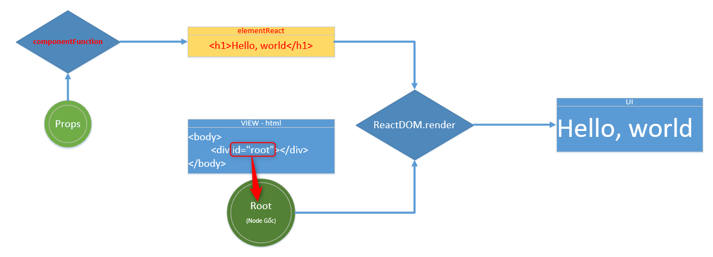

# Duy ghi chú

---

- Ví dụ đơn giản Hello World ReactJS trong file .JSX

```js
ReactDOM.render(
  <h1>Hello, world!</h1>, 
  document.getElementById('root')
);
```

- Element trong ReactJS (elementReact)

```js
const element = <h1>Hello, world!</h1>;

const elementReact = <h1>Hello, world!</h1>;
```

- Element trong html DOM

```html
  <h1>Tài liệu học HTML</h1>

  <p>Tài liệu học CSS<p>
  <p>Tài liệu học JavaScript<p>
  
  <div id="root"></div>
```

- Thay đổi nội dung của Element DOM html

```js
const html = `<h1>Hello, world</h1>`;

document.querySelector('#root').innerHTML = html;
```

- Cách mà ReactJS render

```js
ReactDOM.render(
  <h1>Hello, world!</h1>, 
  document.getElementById('root')
);
```

```js
const name = 'Josh Perez';
const elementReact = <h1>Hello, {name}</h1>;

ReactDOM.render(
  elementReact,
  document.getElementById('root')
);
```

- Cách để cập nhật “giao diện” (UI) đó là tạo ra một element mới và truyền nó vào ReactDOM.render()

```js
function tick() {
  const element = (
    <div>
      <h1>Hello, world!</h1>
      <h2>It is {new Date().toLocaleTimeString()}.</h2>
    </div>
  );
  ReactDOM.render(element, document.getElementById('root'));
}

setInterval(tick, 1000);
```


- **root** : còn gọi là một nốt (node) DOM gốc "root", sẽ là element có `id="root"`của DOM html được sử dụng React render giao diện vào element này.

Trong "tệp" (file) HTML có một thẻ `<div>` :

```html
<div id="root"></div>
```

Chúng tôi gọi cái này là một nốt (node) DOM gốc "root" bởi về mọi thứ bên trong nó sẽ được quản lý bởi React DOM.

Các ứng dụng đã xây dựng với React thường có duy nhất một nốt (node) DOM "gốc" (root). Nếu bạn kết hợp React vào trong một ứng dụng đã tồn tại, bạn có thể có nhiều "nốt" (node) DOM gốc "bị cô lập" (isolated) như bạn muốn.

Để render một React element vào bên trong một "nốt" (node) DOM gốc, truyền tất cả vào [`ReactDOM.render()`](./react-dom.md#render):

```js
const element = <h1>Hello, world</h1>;
ReactDOM.render(element, document.getElementById('root'));
```

Ví dụ trên hiển thị dòng chữ "Hello, world" trên trang web.



